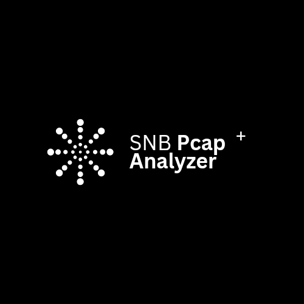

# SNB PCAP Analyzer 🔍

[](https://opensource.org/licenses/MIT)
[](https://www.python.org/downloads/)
[](https://github.com/yourusername/snb-pcap-analyzer)

A professional network traffic analysis tool that provides comprehensive insights into PCAP/PCAPNG files with advanced security analysis, visualization, and reporting capabilities.

## 🚀 Features

### ✨ **Core Analysis Capabilities**

1. **📊 Protocol Analysis**
   - Detailed breakdown of all protocols (TCP/UDP/ICMP/ARP/etc.)
   - Packet count and percentage distribution
   - Protocol-specific statistics

2. **💬 Top Talkers Analysis**
   - Identifies hosts generating the most traffic
   - Sorting by packet count and data volume
   - Communication pair analysis
   - Bytes and packet statistics per IP

3. **🚪 Advanced Port Analysis**
   - Most accessed destination ports
   - Well-known service identification
   - Unusual/suspicious port detection
   - Port scanning detection

4. **🚨 Enhanced Threat Detection**
   - Port scan detection (multiple ports from single source)
   - Failed connection analysis
   - Suspicious port usage detection
   - Potential backdoor identification
   - ARP spoofing detection
   - ICMP sweep detection
   - Amplification attack detection

5. **🌍 IP Geolocation**
   - Geographic location for public IPs
   - Country and city identification
   - Location-based traffic analysis
   - Suspicious geographic patterns

6. **⏰ Traffic Timeline Analysis**
   - Capture duration and timing
   - Traffic patterns over time
   - Peak usage identification
   - Packets per second calculations

7. **🔍 DNS Analysis**
   - DNS query and response extraction
   - Domain name statistics
   - DNS tunneling detection
   - Suspicious domain pattern analysis
   - Long domain name detection

8. **📈 Visualization Features**
   - Protocol distribution pie charts
   - Top ports bar charts
   - Traffic timeline graphs
   - Top talkers visualization
   - Geographic distribution charts
   - Suspicious activity summaries

## 🛠️ Installation

### Prerequisites
```bash
pip install scapy
```

### Optional Features
For full functionality, install additional packages:
```bash
pip install -r requirements.txt
```

Or install individually:
```bash
# For geolocation features
pip install requests

# For visualization features
pip install matplotlib

# Optional: for advanced data processing
pip install pandas numpy
```

## 📋 Usage

### Basic Analysis
```bash
python pcap_analyzer.py your_file.pcapng
```

### Advanced Options
```bash
# Disable geolocation (faster analysis)
python pcap_analyzer.py --no-geo your_file.pcapng

# Disable visualizations
python pcap_analyzer.py --no-viz your_file.pcapng

# Custom output filename
python pcap_analyzer.py -o custom_report.csv your_file.pcapng

# Combine options
python pcap_analyzer.py --no-geo --no-viz -o report.csv your_file.pcapng
```

## 📸 Screenshots

### Terminal Output


### Generated Charts


## 📊 Output Features

### Terminal Output
- **Analysis Summary**: Total packets, duration, analysis time
- **Protocol Distribution**: Packet count and percentages by protocol
- **IP Analysis**: Source/destination IPs with classification (LOCAL/LAN/PUBLIC)
- **Top Talkers**: Most active hosts by traffic volume
- **Port Analysis**: Most accessed ports with service identification
- **Communication Pairs**: Most active IP-to-IP communications
- **DNS Analysis**: Query statistics and suspicious patterns
- **Geographic Analysis**: Location data for external connections
- **Security Analysis**: Suspicious activities and threat indicators
- **Timeline Information**: Traffic patterns and timing analysis

### CSV Report
Comprehensive CSV export includes:
- Protocol statistics with percentages
- Complete IP lists with geolocation data
- Top talkers by packets and bytes
- Communication pair analysis
- Port usage statistics
- DNS query analysis and suspicious patterns
- Local machine network information
- Detailed suspicious traffic analysis

### Visualization Charts
When matplotlib is available:
- Protocol distribution pie chart
- Top destination ports bar chart
- Traffic timeline graph
- Top talkers by traffic volume
- Geographic distribution of external IPs
- Suspicious activity type breakdown

## 🔒 Security Analysis Features

### Threat Detection
- **Port Scanning**: Detects sources accessing many different ports
- **Failed Connections**: Identifies connection failures and potential attacks
- **Suspicious Ports**: Flags known attack vectors (SSH, Telnet, RDP, backdoors)
- **Unusual Traffic**: Detects abnormal port usage and traffic patterns
- **DNS Tunneling**: Identifies potential data exfiltration via DNS
- **ARP Spoofing**: Detects potential ARP poisoning attempts
- **Amplification Attacks**: Identifies large DNS/NTP packets

### Traffic Classification
- **LOCAL**: Traffic from your machine
- **LAN**: Private network traffic (192.168.x.x, 10.x.x.x, 172.16-31.x.x)
- **PUBLIC**: Internet traffic with geolocation data

## 🤝 Contributing

Contributions are welcome! Please feel free to submit a Pull Request. For major changes, please open an issue first to discuss what you would like to change.

1. Fork the repository
2. Create your feature branch (`git checkout -b feature/amazing-feature`)
3. Commit your changes (`git commit -m 'Add some amazing feature'`)
4. Push to the branch (`git push origin feature/amazing-feature`)
5. Open a Pull Request

## 🐛 Bug Reports & Feature Requests

Please use the [GitHub Issues](https://github.com/SNB220/SNB-pcap-analyzer/issues) page to report bugs or request new features.

## ⭐ Star History

If you find this tool useful, please consider giving it a star on GitHub!

## 📞 Support

- 📧 Email: 
- 💬 GitHub Discussions: [SNB PCAP Analyzer Discussions](https://github.com/yourusername/SNB-pcap-analyzer/discussions)
- 📖 Documentation: [Wiki](https://github.com/SNB220/SNB-pcap-analyzer/wiki)

## 🎯 Use Cases

- **Network Security Analysis**: Identify potential threats and attacks
- **Traffic Monitoring**: Understand network usage patterns
- **Incident Response**: Analyze suspicious network activity
- **Network Troubleshooting**: Identify communication issues
- **Compliance Auditing**: Generate detailed network reports
- **Forensic Analysis**: Investigate network incidents

## ⚠️ Notes

- Geolocation requests may take time for large numbers of public IPs
- Some features require internet connectivity (geolocation)
- Visualization requires matplotlib installation
- Large PCAP files may require significant processing time
- Analysis progress is displayed during processing

## 🤝 Example Output

```
🔍 SNB PCAP Analyzer v1.0 - Professional Network Analysis Tool
================================================================
Processing 50,000 packets...
Analysis completed in 15.32 seconds
================================================================

📊 ANALYSIS SUMMARY
----------------------------------------
Total packets analyzed: 50,000
Capture duration: 0:45:32
Analysis time: 15.32 seconds

🔌 PROTOCOL DISTRIBUTION
----------------------------------------
     TCP:   35,420 packets ( 70.8%)
     UDP:   12,150 packets ( 24.3%)
    ICMP:    2,280 packets (  4.6%)
     ARP:      150 packets (  0.3%)

🌐 IP ADDRESS ANALYSIS
----------------------------------------
Unique source IPs: 245
Unique destination IPs: 1,832
Local machine IPs: 3
Private network IPs: 156
Public IPs: 1,918

🚨 SECURITY ANALYSIS
----------------------------------------
Suspicious activities detected: 23
  • Port Scan - 15 ports: 3 incidents
  • Suspicious Port: 12 incidents
  • Multiple Failed Connections - 8: 2 incidents
```

## 📝 License

This project is licensed under the MIT License - see the [LICENSE](LICENSE) file for details.

## 🙏 Acknowledgments

- **Scapy**: For the powerful packet analysis capabilities
- **Matplotlib**: For visualization features
- **Requests**: For IP geolocation services
- **Community**: For feedback and contributions

---

**Made with ❤️ by SNB** | **Happy Network Analysis!** 🎉

<div align="center">
  
</div>
